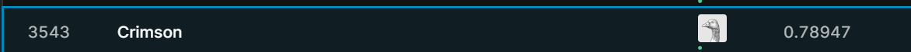

Demo-RandomForest
===================

摘要
------

透過titanic data裡有各種每個人的資訊，判斷是否有存活，利用RandomForest的方式去預測。
對於缺漏值透過整體資料性質做填補。

Program summary
-----------------

* Data : https://www.kaggle.com/c/titanic/data

* Kaggle Score
* 
